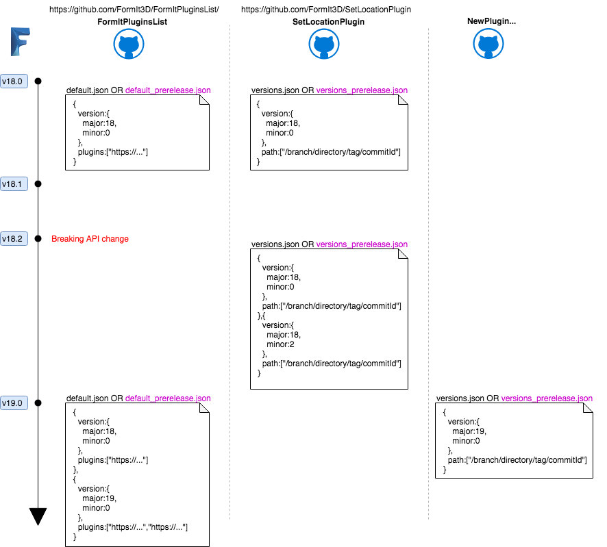

# FormItPluginsList 

## Development

To make and test changes, non-released builds of FormIt clients will look at `default_prerelease.json`.

If you want to target a specific client version, make sure to target the correct version object.

## Releasing 

To release changes, first ensure they have been tested, then copy to `default.json`.